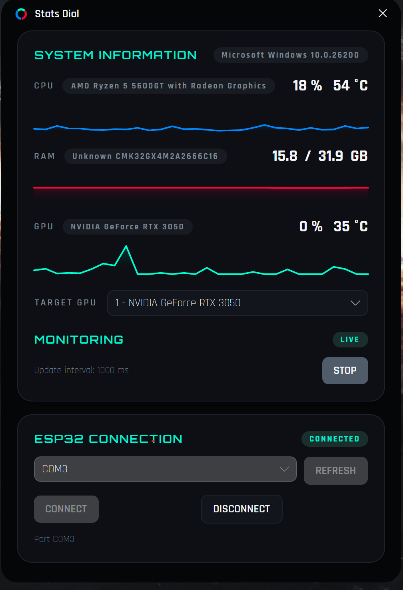

# Stats Dial Desktop

A desktop app that reads PC hardware info and sends it via serial to the [Stats Dial Firmware](https://github.com/joaootaviofarias/statsdial-firmware) running on an ESP32 with a round LCD display.

## 🖥️ Windows App

A desktop GUI (built with Avalonia) for monitoring and sending hardware stats.

**Features:**

- **Real-time Monitoring:** Displays CPU usage/temperature, GPU usage/temperature, and RAM usage.
- **Target GPU Selection:** Choose which GPU to monitor when multiple are installed.
- **ESP32 Connection:** Select COM port, connect/disconnect, and refresh available ports.
